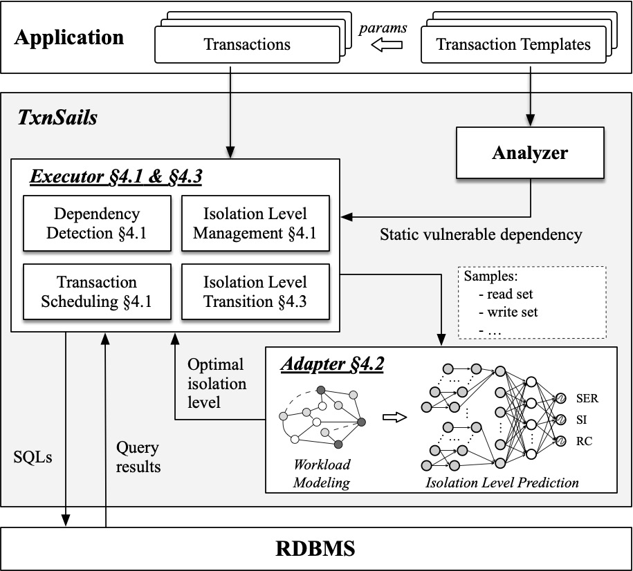

# TxnSails
The code base of TxnSails: Achieving Serializable **Transaction** Scheduling with **S**elf-**A**daptive **I**solation **L**evel **S**election.

## Brief introduction 
TxnSails works in the middle tier between database and application. It meets three requirements:  
1. It requires minimal modifications to client applications and database kernels, ensuring low implementation overhead.
2. It must be efficient to handle dangerous structures under various lower isolation levels while ensuring SER.
3. It must adaptively select the optimal isolation level to maximize performance in response to dynamic workloads.

The architecture of TxnSails is illustrated in figure below.

<div align=center>

</div>

## Code description
### Code Navigation
Key modules and corresponding source code: 
1. `Analyzer` - src/.../worker/OfflineWorker, src/.../analysis/*
2. `Executor` - src/.../worker/OnlineWorker, src/.../execution/validation/*
3. `Adapter` - src/.../worker/{Adapter, Flusher}, src/.../execution/sample/\*, isolation\_adapter/\* (Python)

Note: `...` represents the filepath `main/java/org/dbiir/txnsails`.

**Analyzer**: 

**Executor**: 

**Adapter**: 

## Client Libs
### Interface description
We provide four apis for clients: 

- `register() -> (status, serverSideIdx)`:
- `analyse() -> (status)`:
- `execute() -> (status, results/errorMsg)`:
- `commit()/rollback() -> (status)`: 

Application developer should rebuild a portion of their code to utilize TxnSails' capabilities and TxnSails can automatically guarantee the serializable.
Note that we do not modify the application workload to achieve serializable, for example, we do not either promote reads to writes or introduce outside lock manager.
We would continue to improve above apis and TxnSails to support serializable transactions for more hetergeneous database systems, 
thereby further reducing application development costs.


### How to use
**Online workflow**:
1. connect to TxnSailsSever;
2. invoke 

**Offline workflow**:

## Evaluation
### Environment and Configuration
We conducted our experiments on two servers, each equipped with an AMD EPYC 7K62 Processor, which includes 16 cores, 64 GB of DRAM, and a 500 GB SSD. 
The operation system was CentOS Linux release 7.9. 

We utilize BenchBase as our benchmark simulator, deploying it on a single server. We modify it to interface with TxnSails. By default, the experiments are conducted using 128 client terminals.

We deployed PostgreSQL 15.2~\cite{PostgreSQL} as the database engine. For our database configuration, we allocated a buffer pool size of 24GB, limited the maximum number of connections to 2000, and established a lock wait timeout of 100 ms. To eliminate network-related variables from affecting the results, both \sysname and PostgreSQL were deployed on another server. 

### How to Build
TxnSails requires JDK 21 and Maven 3.9+ for compilation. To run the build scripts, you need to ensure that Python 3.9+ is installed.
Meanwhile, the graph learning module requires <TODO>.

You can run the following command to build TxnSails server:

```shell
mvn clean package -Dmaven.javadoc.skip=true -Dcheckstyle.skip=true -Drat.skip=true -Djacoco.skip=true -DskipITs -DskipTests
```

This command will compile the project and the fat jar can be found in `target` folder. 

### How to Run
We provide python scripts located in the `scripts/` folder to generate the corresponding `.xml` configuration files. Before running the tests, you should modify the information in the python script to ensure the generation of configuration files that meet the requirements, including the JDBC connection URL to connect to the database, and the database username and password.

For example, you can run the following command generate your ycsb configuration files:

``` shell
python3 gen_ycsb_config.py
```

After you have completed the compilation and generated necessary configuration files, you can run the benchmark tests using the run_test.py script. TxnSails does not include the data loading part. That means you should load data into the database by yourselves before running the tests. The schemas for all benchmarks (SmallBank, TPC-C, YCSB) are located in /config.

You can run the following command to get help:

``` shell
python3 runTxnSailsServer.py -h
```

The following options are provided:

```shell
  -h, --help            show this help message and exit
  -f {scalability,hotspot-128,skew-128,wc_ratio-256,bal_ratio-128,wc_ratio-128,random-128,no_ratio-128,pa_ratio-128,wr_ratio-128} [{scalability,hotspot-128,skew-128,wc_ratio-256,bal_ratio-128,wc_ratio-
128,random-128,no_ratio-128,pa_ratio-128,wr_ratio-128} ...], --function {scalability,hotspot-128,skew-128,wc_ratio-256,bal_ratio-128,wc_ratio-128,random-128,no_ratio-128,pa_ratio-128,wr_ratio-128} [{scalability,hotspot-128,skew-128,wc_ratio-256,bal_ratio-128,wc_ratio-128,random-128,no_ratio-128,pa_ratio-128,wr_ratio-128} ...]
                        specify the function
  -w {ycsb,tpcc,smallbank}, --workload {ycsb,tpcc,smallbank}
                        specify the workload
  -e {postgresql}, --engine {postgresql}
                        specify the workload
  -n CNT, --cnt CNT     count of execution
  -p PHASE, --phase PHASE
                        online predict or offline training
```

### Running example
You can run the command to execute the hotspot-128 test of the SmallBank benchmark in PostgreSQL:
```shell
python3 runTxnSailsServer.py -w smallbank -f hotspot-256 -e postgresql
```

plot the results by python.
